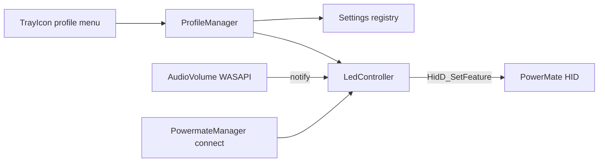

# Release 1.3 — Registry settings + volume LED

## Defaults (locked in)

- **Persist:** current profile index (`Scroll` / `Volume`) under `HKCU\Software\PowerMateControl`.
- **LED:** mirrors master volume only in **Volume** profile; **off** when muted or when **Scroll** is active; refresh on connect/reconnect.
- **No driver change:** keep the stock Windows HID path (no WinUSB/Zadig). LED via `HidD_SetFeature`, same approach as [Aldaviva/PowerMate](https://github.com/Aldaviva/PowerMate).

## Architecture



## 1. Registry settings

Add [`src/Settings.h`](src/Settings.h) / [`src/Settings.cpp`](src/Settings.cpp):

- Key: `HKCU\Software\PowerMateControl`
- Value: `Profile` (`REG_DWORD`, `0` = Scroll, `1` = Volume)
- `Load()` / `SaveProfile(DWORD)` helpers; create key on first write

Wire into [`ProfileManager`](src/ProfileManager.cpp):

- On startup (`main` or first `GetCurrentProfileIndex` path): load profile before tray init
- In `SetCurrentProfile`: save after a successful change

Autostart stays on the existing Run key (already persistent).

## 2. PowerMate LED write

Extend [`PowermateManager`](src/PowermateManager.h):

- `static void SetLedBrightness(BYTE level);` — under `deviceMutex`, send feature report (Aldaviva layout):

```text
{ 0x00, 0x41, 0x01, 0x01 /* LightBrightness */, 0x00, level, 0x00, 0x00, 0x00 }
```

- Also clear pulse-always (`feature 0x03`, payload `0`) once on connect so solid brightness sticks
- Call from connect/reconnect paths after open succeeds
- Link `hid.lib` already present; use `HidD_SetFeature`

## 3. System volume → LED

Add [`src/AudioVolume.h`](src/AudioVolume.h) / [`src/AudioVolume.cpp`](src/AudioVolume.cpp):

- COM init in `wWinMain` (`CoInitializeEx`)
- `IMMDeviceEnumerator` → default render endpoint → `IAudioEndpointVolume`
- Read `GetMasterVolumeLevelScalar` + `GetMute`
- Register `IAudioEndpointVolumeCallback` so LED tracks OS / other-app volume changes (not only knob turns)
- Map: muted → `0`; else `round(scalar * 255)`

Add thin [`LedController`](src/LedController.cpp) (or methods on ProfileManager):

- `Refresh()`: if Volume profile → set LED from current volume; else → `0`
- Invoke from: profile change, audio notify, device connect/resume

Keep existing `VK_VOLUME_*` / mute `SendInput` behavior; notifications update the LED after those keys take effect.

## 4. Build / docs / release

- Add new `.cpp` files to [`scripts/build.ps1`](scripts/build.ps1); link `ole32.lib` (and `uuid` if needed for COM)
- Update [`CHANGELOG.md`](CHANGELOG.md) for **1.3.0**, bump [`VERSION`](VERSION) / [`src/version.h`](src/version.h), README current version + short usage note
- Tag/push `v1.3.0` after a local Release build verify

## Out of scope

- Persisting autostart under the app key (already in Run)
- Hardware LED pulse animations
- Changing volume via WASAPI instead of media keys (can revisit later)
