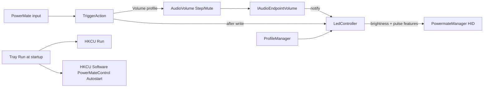

# Release 1.4 — WASAPI volume, LED pulse, autostart settings

## Defaults (locked in)

- **All three** deferred items from [1.3 plan](1.3_registry_and_led.plan.md).
- **WASAPI writes:** `VolumeStepUp` / `VolumeStepDown` / `SetMute` on the existing `IAudioEndpointVolume`; call `LedController::Refresh()` after each change. Accept no Windows volume OSD.
- **LED pulse:**
  - **Scroll:** hardware pulse on (fixed mid speed).
  - **Volume unmuted:** solid brightness from master volume (current behavior).
  - **Volume muted (or scalar ≤ 0):** hardware pulse on.
- **Autostart:** keep writing the Run key (what Windows launches); also persist `Autostart` under `HKCU\Software\PowerMateControl`.

Version: bump to **1.4.0** (minor — new features).

## Architecture

## 1. Autostart under app settings key

Extend [`src/Settings.h`](src/Settings.h) / [`src/Settings.cpp`](src/Settings.cpp):

- Value: `Autostart` (`REG_DWORD`, `0` / `1`)
- `LoadAutostart(bool&)` / `SaveAutostart(bool)`

Wire in [`src/trayIcon.cpp`](src/trayIcon.cpp):

- `ToggleAutoStart`: after updating Run, call `Settings::SaveAutostart`
- On tray init (or first menu populate): if Settings says enabled and Run entry missing, recreate Run (recover preference); if Run present and Settings missing, backfill Settings from Run

`IsAutoStartEnabled()` stays Run-key based (source of truth for “will Windows start us”).

## 2. WASAPI volume write path

Extend [`src/AudioVolume.h`](src/AudioVolume.h) / [`src/AudioVolume.cpp`](src/AudioVolume.cpp):

- `StepUp()` / `StepDown()` → `IAudioEndpointVolume::VolumeStepUp` / `VolumeStepDown`
- `ToggleMute()` → `GetMute` + `SetMute`
- Thread-safe under existing `g_audioMutex`

Update [`src/TriggerAction.cpp`](src/TriggerAction.cpp) Volume profile:

- Replace `SendKey(VK_VOLUME_*)` helpers with `AudioVolume` calls
- After each successful change, `LedController::Refresh()` (immediate LED; notify still covers external mixer changes)

Scroll profile unchanged (`SendInput` wheel / double-click).

## 3. Hardware LED pulse

Aldaviva feature IDs already partially used (`kFeatureBrightness = 0x01`, `kFeaturePulseAlways = 0x03`). Add `kFeaturePulseSpeed = 0x04`.

Extend [`PowermateManager`](src/PowermateManager.h) pending LED state (same input-thread apply pattern as 1.3.1 — never block UI):

- Queue brightness **and** pulse-on/off (+ fixed pulse speed when enabling)
- `SetLedBrightness` alone is not enough; add something like `SetLedState(BYTE brightness, bool pulse)` or separate `SetLedPulse(bool)` that coalesces with pending brightness
- Apply on input thread: if pulse → `SetFeature(PulseAlways, 1)` + `SetFeature(PulseSpeed, fixed)`; else → `PulseAlways = 0` + brightness

Update [`LedController::Refresh`](src/LedController.cpp):

| Profile / state | LED |
|---|---|
| Scroll | pulse on, brightness ignored / leave mid |
| Volume, not muted, scalar > 0 | pulse off, brightness = round(scalar×255) |
| Volume, muted or scalar ≤ 0 | pulse on |

Connect/profile/audio-notify paths already call `Refresh()` — no new call sites beyond TriggerAction post-write.

## 4. Build / docs / release

- No new `.cpp` files expected (extend existing)
- [`CHANGELOG.md`](CHANGELOG.md): **1.4.0** Added section; bump [`VERSION`](VERSION) / [`src/version.h`](src/version.h); README usage table (WASAPI volume, LED pulse rules, Autostart registry note)
- Local `.\scripts\build.ps1 -Configuration Release` verify before tag
